# mnist-mc-dropout


# Description

Writing Python (Lasagne + Theano library) code for respresenting model uncertainty in deep learning. Based on the following:

* 2016: [Dropout as a Bayesian Approximation: Representing Model Uncertainty in Deep Learning](https://arxiv.org/abs/1506.02142), [Dropout as a Bayesian Approximation: Appendix](https://arxiv.org/abs/1506.02157)

Training takes about less than 3 hours (for 3000 epochs) minutes with GPU; thanks [National Supercomputing Centre (NSCC) Singapore](http://www.nscc.sg)!

The main implementation is in ```mnist_mc_dropout.py``` which uses helper functions from ```__helpers__.py```, and of course the dataset ```mnist.pkl.gz```. For plotting training/validation errors see ```plot_error.py```. All the outputs are saved/pickled in the ```output``` folder.

Run/theano settings: ```THEANO_FLAGS='mode=FAST_RUN, device=gpu, floatX=float32' python mnist_mc_dropout.py```


# (Some) Results:

## Training details...

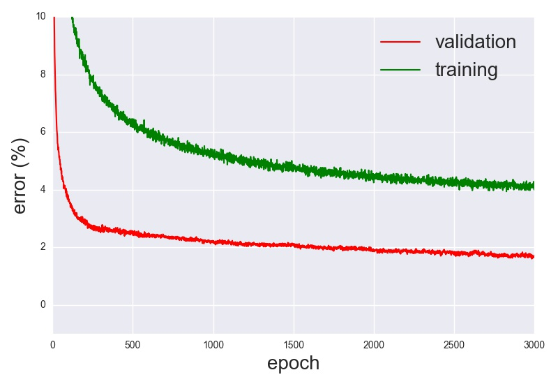

## Interesting cases...

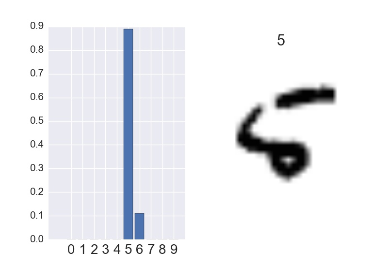 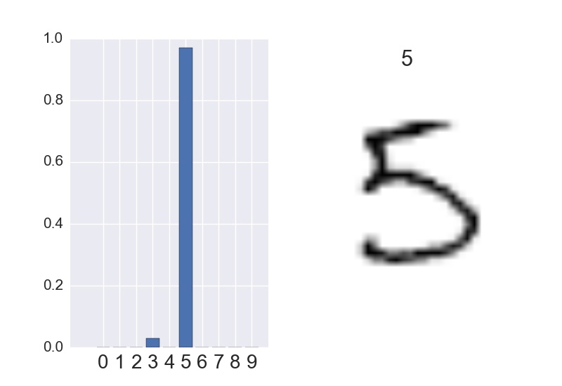

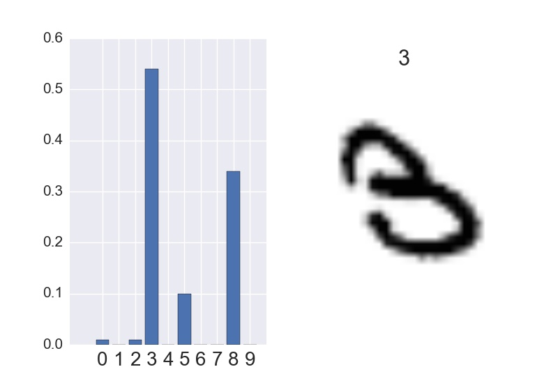 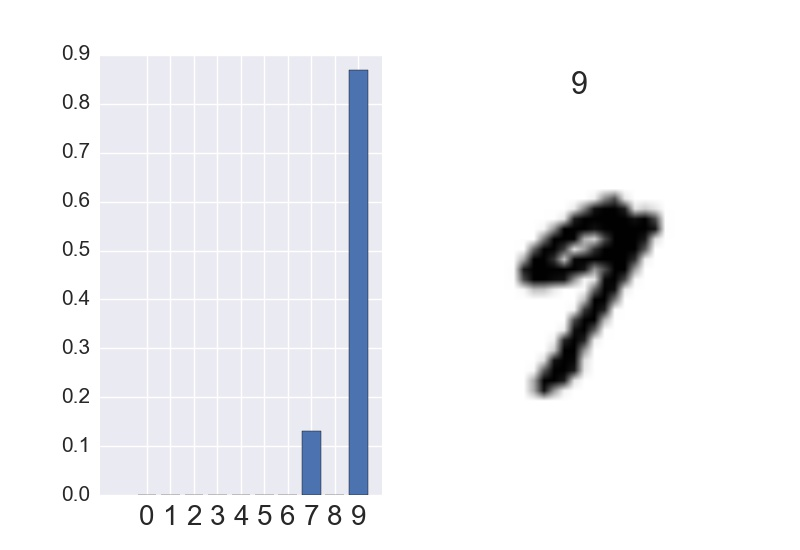

 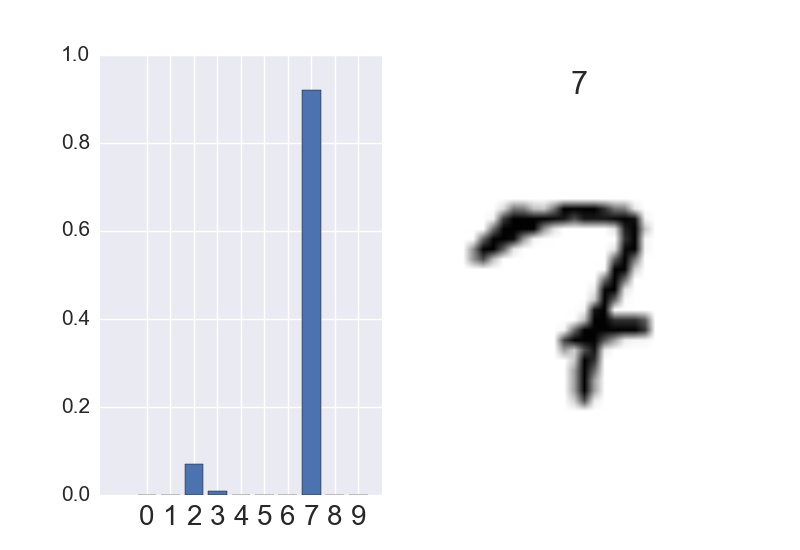

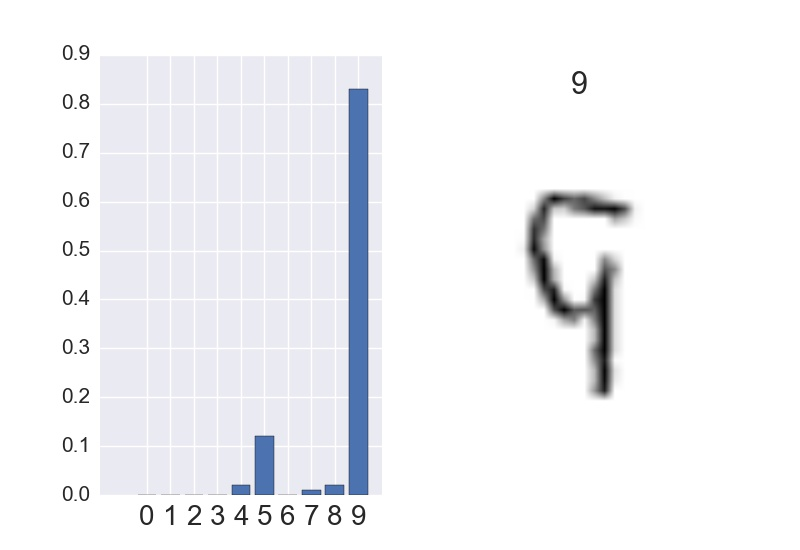 

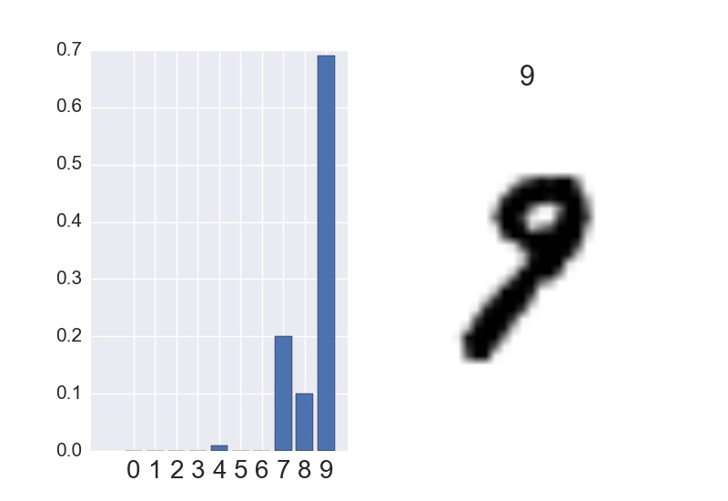 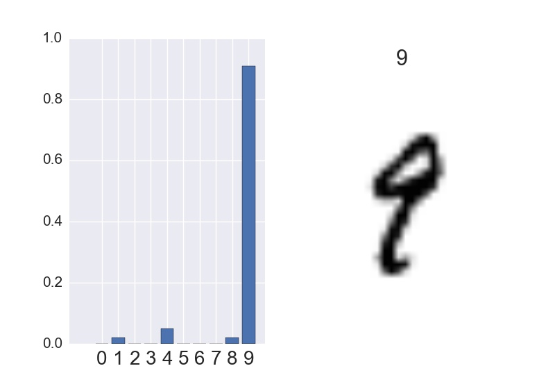

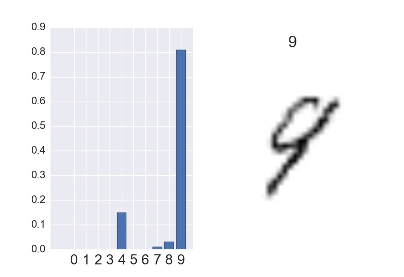 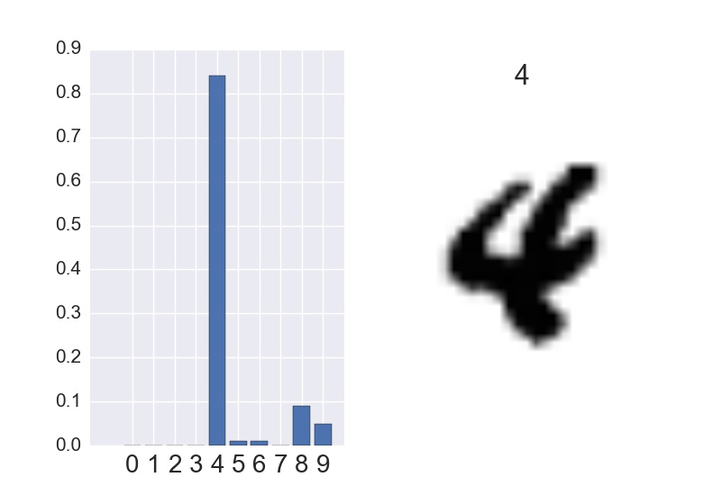